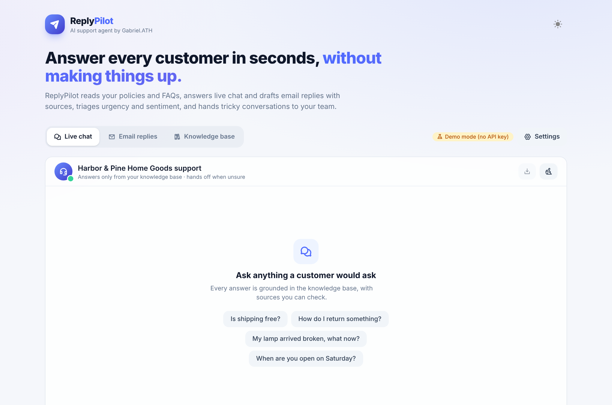
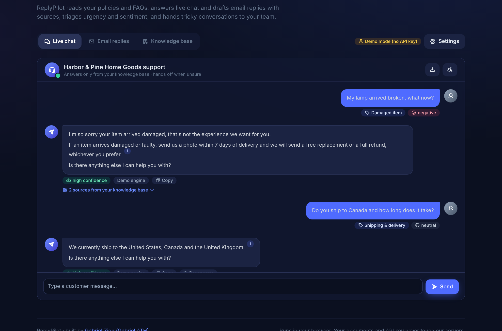

<div align="center">


# ReplyPilot

**An AI customer-support and email-reply agent that answers from your own business knowledge, cites its sources and hands tricky conversations to a human.**

[**Live demo**](https://gabrielolarinre74-pixel.github.io/replypilot-ai/) · runs in the browser, no sign-up and no API key needed


</div>

## Why businesses use it

Most small teams answer the same questions every day: *Where is my order? Can I get a refund? Are you open on Saturday?* Generic chatbots either give vague answers or confidently make things up.

ReplyPilot works differently:

- It **only answers from your documents** (policies, FAQs, price lists) and shows the exact passages it used.
- It **knows when it doesn't know**. If your knowledge base doesn't cover a question, it says so and hands off instead of guessing.
- It **triages every message** (intent, sentiment, urgency) so angry customers, legal threats and "let me speak to a manager" requests reach a person fast.
- It **drafts full email replies** that answer every question in the customer's email, in the tone you choose, ready to copy into your inbox.

## Features

### Live chat agent
- Streaming chat interface with Markdown rendering and inline citation badges `¹ ²`
- Expandable **source panel** under every answer, with the passage, its relevance score and how much of the question it covers
- **Confidence indicator** (high / medium / low) based on retrieval coverage
- Follow-up awareness: short follow-ups such as "and to Canada?" reuse the previous question for retrieval
- Regenerate, copy, stop generation, and export the conversation as Markdown

### Email reply assistant
- Paste any customer email and get a complete reply with greeting, empathy line, grounded answers and sign-off
- **Multi-question detection**: every question in the email is retrieved and answered separately
- Automatic **reply subject** (`Re: …` from the original subject, or one based on intent)
- Three tones: Friendly, Professional and Concise
- One-click copy or "Open in mail app" (`mailto:` with subject and body filled in)

### Instant triage (no AI call needed)
- Intent detection: damaged item, refund, shipping, billing, booking, pricing, technical, cancellation, complaint, sales lead
- Sentiment and urgency scoring (including SHOUTING and "I need this today")
- **Human hand-off rules** for legal threats, bank disputes, requests for a manager and strongly negative refund requests

### Knowledge base manager
- Add, edit and delete documents, or **upload `.md` / `.txt` files**
- The search index rebuilds instantly on every change
- **Retrieval tester**: type a question and see exactly which passages the agent would use
- Export the knowledge base as JSON, or reset to the sample store
- Everything is saved in the browser (localStorage); nothing is uploaded anywhere

### Two answer engines
| Engine | Needs a key? | How it works |
|---|---|---|
| **Demo engine** (default) | No | Ranks sentences from the retrieved passages and composes an answer from them. It can't invent facts, so it's a safe fallback. |
| **AI model** | Yes (yours) | Sends the numbered passages and strict grounding rules to any **OpenAI-compatible API**: OpenAI, Groq, Together, OpenRouter, or a local Ollama / LM Studio server. |

## How it works

```
customer message
      │
      ├─► triage.ts      intent · sentiment · urgency · hand-off rules
      │
      ├─► rag.ts         chunk docs ➜ BM25 index ➜ per-question retrieval ➜ confidence
      │
      └─► agent.ts       demo engine (extractive)  ──or──  LLM prompt with numbered sources
                                         │
                                         ▼
                          answer + citations + sources + confidence
```

- **Retrieval:** documents are split into ~90-word passages on paragraph and sentence boundaries, then indexed with Okapi BM25. Queries get light stemming and business synonyms (refund ↔ money back, shipping ↔ delivery, broken ↔ damaged), with synonyms weighted at half strength.
- **Grounding:** in AI mode the system prompt tells the model to use only the numbered passages, cite them, never promise refunds or dates that aren't in the passages, and use a fixed hand-off sentence when the answer isn't there.
- **Privacy:** the app is fully static. Documents and the optional API key stay in the user's browser, and the key is only ever sent to the API URL the user configures (https is required, except for localhost).

## Tech stack

- [Astro 5](https://astro.build) (static output) + [SolidJS](https://www.solidjs.com) for the interactive app
- [UnoCSS](https://unocss.dev) with Phosphor icons, light and dark themes
- `markdown-it` (raw HTML disabled, so model output can't inject scripts) + `highlight.js` core
- [Vitest](https://vitest.dev) unit tests for retrieval, triage, the demo engine, prompts and settings validation
- GitHub Actions: tests, build and deploy to GitHub Pages on every push

## Screenshots

| Email replies | Knowledge base |
|---|---|
|  |  |

| Landing | Dark mode |
|---|---|
|  |  |

## Run it locally

```bash
git clone https://github.com/gabrielolarinre74-pixel/replypilot-ai.git
cd replypilot-ai
npm install
npm run dev        # http://localhost:4321
npm test           # unit tests
npm run build      # static site in dist/
```

To use a real model, open **Settings → AI model**, paste your API key and (optionally) change the base URL and model name. For a fully local setup, point the base URL at Ollama: `http://localhost:11434/v1`.

`.env.example` lists the optional build-time defaults. Never put an API key in it: `PUBLIC_*` values are bundled into the browser.

## Use it for your business

1. Open the **Knowledge base** tab, delete the sample documents and paste or upload your own policies and FAQs.
2. Set your business name and email signature in **Settings**.
3. Use the **Retrieval tester** to check that common questions find the right passages.
4. Answer chats and draft emails, and review anything flagged for a human before you send it.

## Project structure

```
src/
  lib/
    text.ts             tokenizer, stemmer, synonyms, sentence splitter
    rag.ts              chunking, BM25 index, confidence, multi-question search
    triage.ts           intent / sentiment / urgency / hand-off rules
    agent.ts            demo engine, LLM prompt builder, streaming client
    settings.ts         settings, safe storage, validation
    sampleKnowledge.ts  sample store used by the live demo
  components/           Solid components (chat, email, knowledge base, settings)
tests/                  Vitest suites
```

## License

MIT. See [LICENSE](LICENSE).

---

Built by **Gabriel Zion · Gabriel.ATH**. I build websites, apps and AI automation that help businesses grow. [Portfolio](https://gabrielzion-portfolio.vercel.app)
