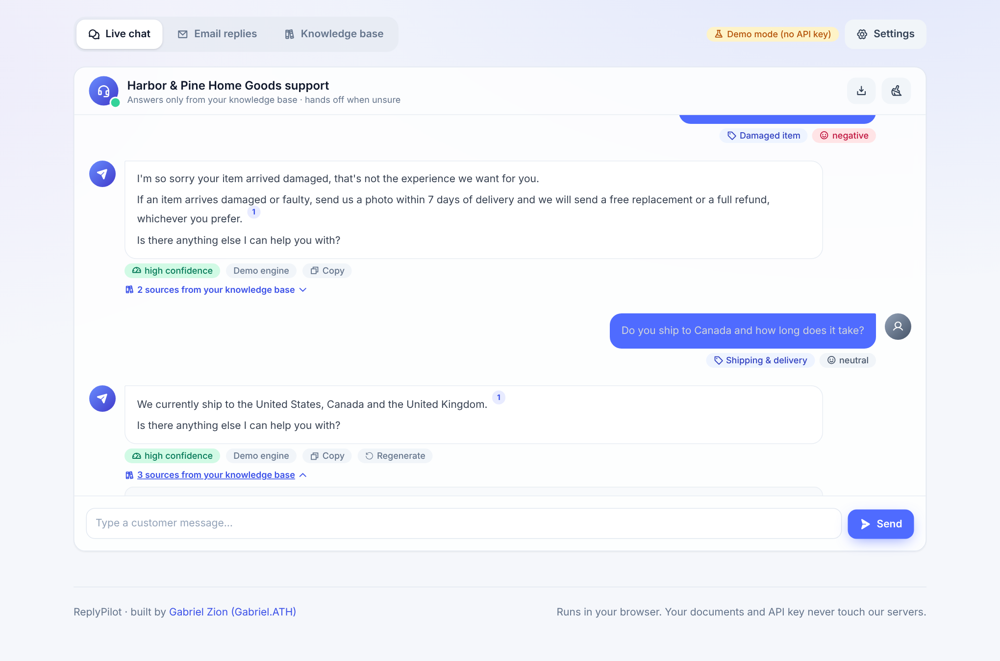
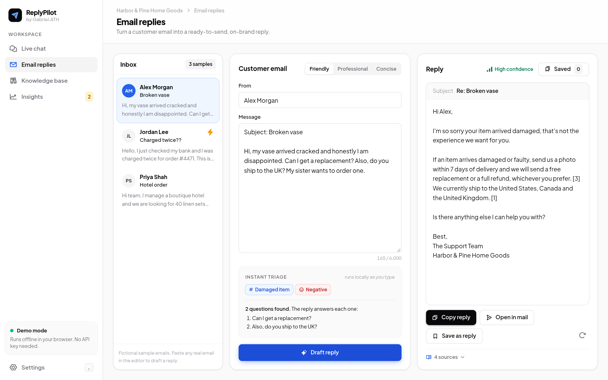
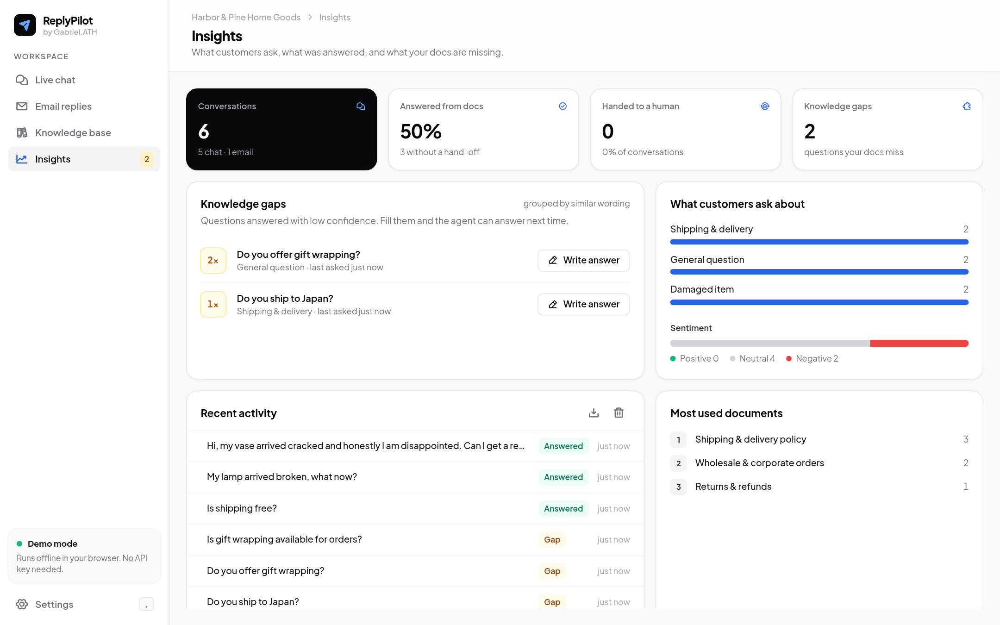
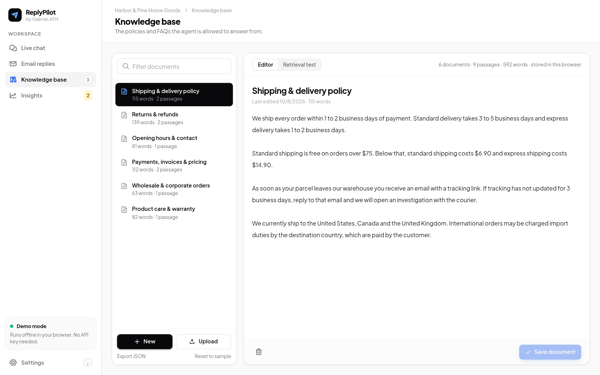
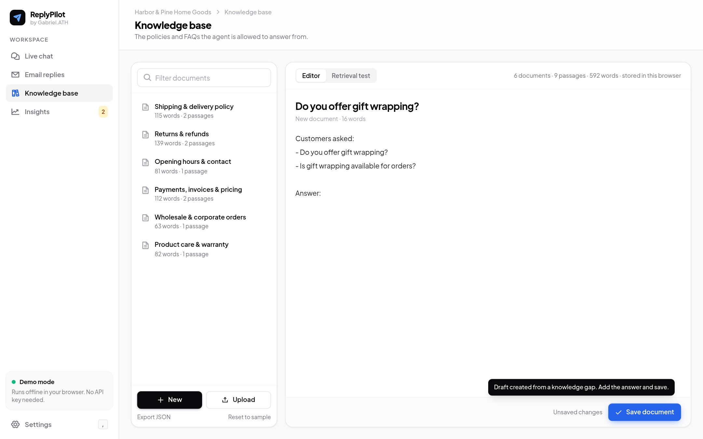
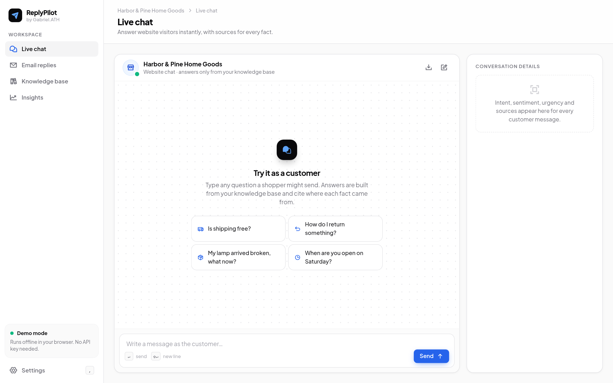
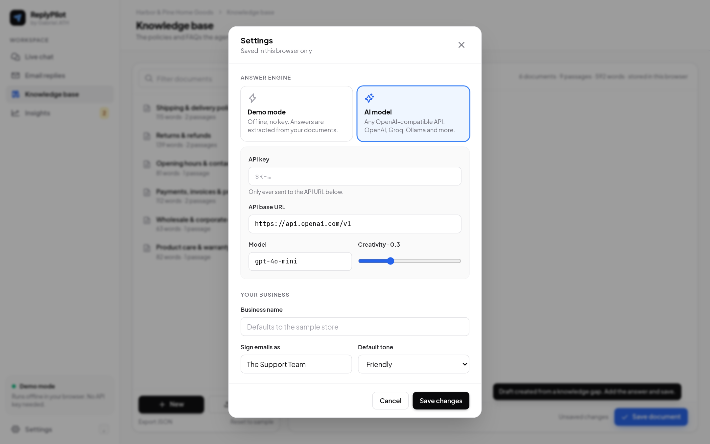

<div align="center">


# ReplyPilot

### The support desk that answers from your own policies, and tells you what they're missing.

Live chat, email replies, a knowledge base and insights in one browser app.
Every answer cites its sources, risky conversations go to a person, and questions your docs can't answer turn into a to-do list.

**Runs entirely in your browser** · demo mode works offline with no API key · [Run it locally](#run-it-locally)



</div>

---

## Why ReplyPilot

Small teams answer the same questions every day: delivery times, returns, broken items, opening hours. Generic chatbots either make things up or give vague answers. ReplyPilot does two things differently:

1. **It only answers from what you wrote.** Each reply is built from passages in your knowledge base and shows numbered citations. If the docs don't cover a question, it says so and hands the conversation to a person instead of guessing.
2. **It shows you what to write next.** Every unanswered question is logged and grouped, so you can see which policies are missing and fix them in one click.

## Features

### Live chat
- A chat window that works like a real support inbox, with suggested starter questions
- Answers stream in with numbered citations and an expandable list of sources and match strength
- A **conversation details** panel for the selected message shows intent, sentiment, urgency, hand-off reasons, answer confidence and the documents used
- Follow-up questions ("and to Canada?") reuse the previous message as context, but only when needed
- Stop, regenerate, copy, start a new conversation, or download the transcript as Markdown

### Email replies
- A three-pane layout: sample inbox, the customer's email, and your reply
- Finds every question in a long email and answers each one
- Friendly, professional or concise tone, a suggested subject line, and the email signed with your business name
- The draft is editable. Copy it, open it in your mail app, or **save it as a reusable reply**
- **Saved replies**: names are stored as `{{customer}}`, `{{business}}` and `{{agent}}` placeholders and filled in again when you insert them
- Emails flagged for a human get a clear warning before you send

### Knowledge base
- A document library with search, a focused editor and an unsaved-changes indicator
- Upload `.md` or `.txt` files, export everything as JSON, or reset to the sample store
- **Retrieval test**: type a question and see exactly which passages the agent would use, with scores

### Insights
- Conversation count, the share answered from your docs, hand-offs and open knowledge gaps
- **Knowledge gaps**: low-confidence questions grouped by similar wording ("Do you offer gift wrapping?" and "Is gift wrapping available?" count as one), sorted by how often they're asked
- **Write answer** opens a pre-filled draft document in the knowledge base
- Breakdown by topic and sentiment, most-cited documents, recent activity, and CSV export

### Triage on every message
Intent (damaged item, refund, shipping, billing, sales lead and more), sentiment, urgency and hand-off rules for legal threats, requests for a person and very negative messages. It runs locally, with no AI call needed.

### Two engines
| | Demo mode | AI model |
|---|---|---|
| API key | Not needed | Yours, any OpenAI-compatible API |
| How it answers | Picks the best sentences from your docs and adds citations | Sends the question and numbered passages to the model with strict grounding rules |
| Works offline | Yes | No |

## Screenshots

| Email replies | Insights and knowledge gaps |
|---|---|
|  |  |

| Knowledge base | Gap turned into a draft document |
|---|---|
|  |  |

| Empty chat | Settings |
|---|---|
|  |  |

The sample store ("Harbor & Pine Home Goods"), its policies and the inbox emails are fictional.

## How it works

```
customer message
   │
   ├─ triage.ts      intent · sentiment · urgency · hand-off rules
   ├─ rag.ts         BM25 search over passages, synonyms, rarity-weighted coverage → confidence
   ├─ agent.ts       demo engine (grounded sentence picking)  or  LLM prompt with numbered sources
   └─ insights.ts    conversation log → answer rate, topics, knowledge gaps
```

Coverage is weighted by how rare each word is in your docs. A question like "Do you ship to Japan?" therefore gets low confidence when Japan isn't mentioned anywhere, even though "ship" matches.

## Privacy and security
- Everything runs in the browser. Documents, settings, saved replies and the conversation log stay in `localStorage`.
- In AI mode the key is stored only in this browser and sent only to the API URL you set. Non-HTTPS URLs are rejected, except `localhost`.
- Model output is rendered as Markdown with raw HTML turned off, and links open with `rel="noopener noreferrer"`.
- Input sizes are limited (chat messages, emails, documents, uploads), and the log is capped at 500 entries.

## Tech stack
- **Astro 5** (static output) with **SolidJS** islands
- **UnoCSS** with Phosphor icons, **Plus Jakarta Sans** and **JetBrains Mono**
- `markdown-it` and `highlight.js` core for rendering answers
- **Vitest** for retrieval, triage, the demo engine, insights and saved-reply tests
- **TypeScript** type checking and GitHub Actions CI

## Run it locally

You need **Node.js 20+** and npm.

```bash
git clone https://github.com/gabrielolarinre74-pixel/replypilot-ai.git
cd replypilot-ai
npm install
npm run dev        # http://localhost:4321
```

```bash
npm test           # unit tests
npm run check      # type-check
npm run build      # static site in dist/
npm run preview    # serve the production build
```

### Demo mode (no API key)
The app opens in demo mode with the sample store's knowledge base. Try a question in **Live chat**, draft a reply in **Email replies**, then open **Insights** to see the log and any knowledge gaps. Nothing leaves your browser.

### Using a real model
Press <kbd>,</kbd> or open **Settings**, choose **AI model**, then add your API key, base URL and model. Any OpenAI-compatible endpoint works. For a local setup with Ollama, use `http://localhost:11434/v1`.

`.env.example` lists optional build-time defaults. Never put an API key there: `PUBLIC_*` values are bundled into the page.

### Keyboard shortcuts
<kbd>1</kbd>–<kbd>4</kbd> switch sections · <kbd>,</kbd> opens settings · <kbd>Enter</kbd> sends · <kbd>Shift</kbd>+<kbd>Enter</kbd> adds a new line

## Make it yours
1. Open **Knowledge base**, remove the sample documents and add your own policies and FAQs.
2. Set your business name and email signature in **Settings**.
3. Use **Retrieval test** to check that common questions find the right passages.
4. Check **Insights** each week and fill the top knowledge gaps.

## License
MIT. See [LICENSE](LICENSE).

---

Designed and built by **Gabriel Zion · Gabriel.ATH**. I build websites, apps and AI automation that help businesses grow. [Portfolio](https://gabrielzion-portfolio.vercel.app)
